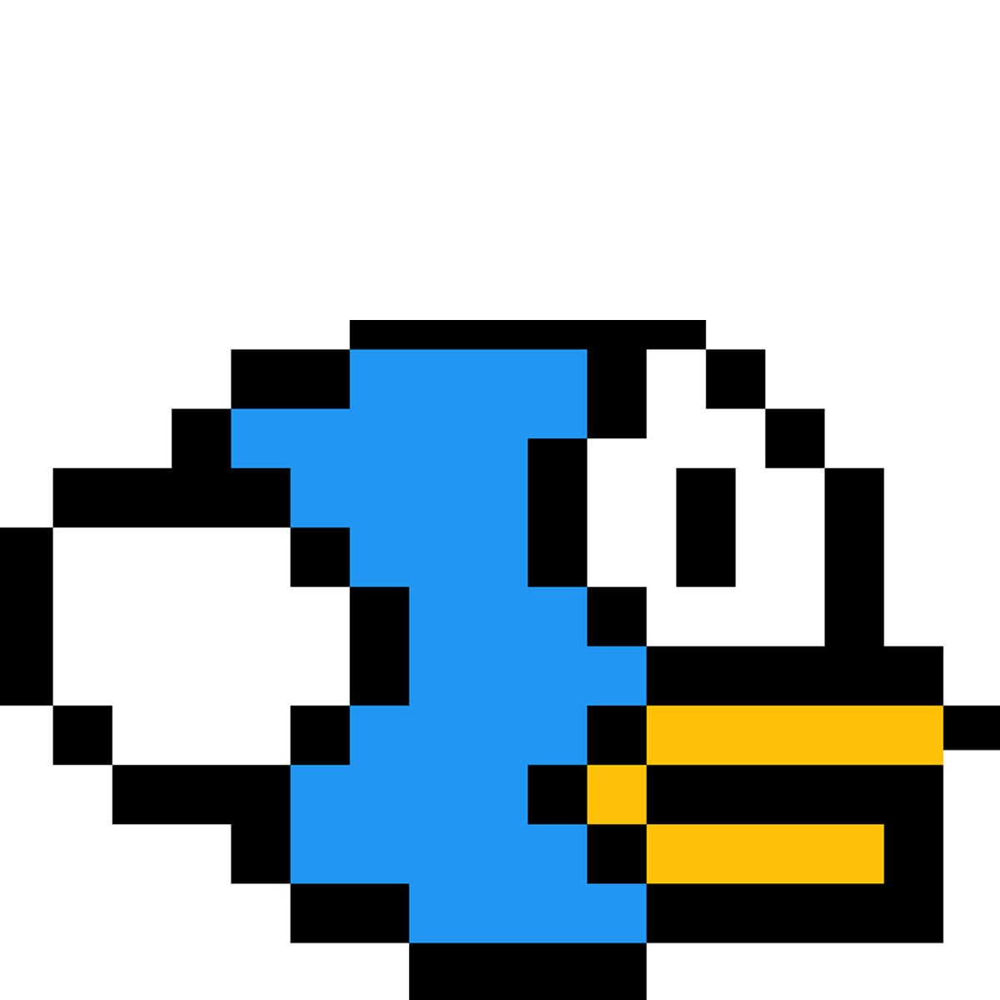

#  Flappy Bird

**Version 1.0.0**

📃 Flappy Bird clone


## ⚙ Technologies

- Python
- PyGame

## 🚀 Launching Guide

1.  Clone The repo
2.  Change the working directory on the app
3.  Install dependencies
```shell
pip install pygame
```
5.  Launch 
```shell
python main.py
```

[](https://www.python.org/downloads/release/python-360/) [](https://www.pip.org/downloads/release/python-360/)
